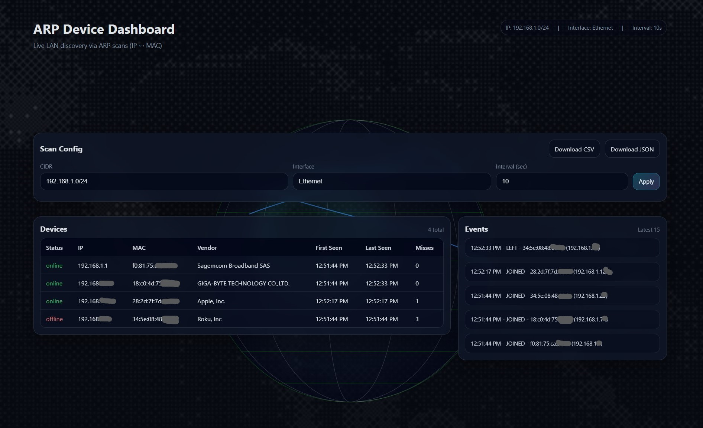

# ARP Device Dashboard

A small networks project that discovers devices on a local LAN using ARP scans and shows them in a live web dashboard.




This was built as a Computer Networks final project focused on how ARP connects Layer 3 (IP) to Layer 2 (MAC) on a local network.

## What it does
- Repeatedly ARP-scans a target subnet (e.g. `192.168.1.0/24`)
- Tracks devices by MAC address (first seen / last seen)
- Marks a device offline after it misses 3 scans
- Displays a dashboard (table + recent join/leave events)

## Features
- Live device table: status, IP, MAC, vendor, first/last seen, misses
- Event feed: JOINED/LEFT
- Vendor lookup using IEEE OUI list (`assets/oui.txt`)
- Export snapshot as CSV/JSON
- Config UI: change CIDR/interface/interval from the page

## Tech stack
- Python
- Scapy (ARP scanning)
- Flask (web server + API)
- Npcap (required on Windows for Scapy layer-2)
- HTML/CSS/JavaScript (simple frontend)

## Requirements
- Windows machine on the same network you want to scan
- Python 3.10+ (tested with Python 3.12)
- Npcap installed (Wireshark installer can add it)
- Run in an Administrator terminal (recommended)

## Install
In an Administrator PowerShell:

```powershell
cd C:\networks-final
python -m venv .venv
.venv\Scripts\activate
pip install -r requirements.txt
```

If Scapy fails with errors about layer-2 sniffing/sending, install Npcap:
- https://nmap.org/npcap/
- Enable: "Install Npcap in WinPcap API-compatible Mode"

## Run
```powershell
cd C:\networks-final
.venv\Scripts\activate
python app.py
```

Open:
- http://127.0.0.1:5000

## Configure
Use the "Scan Config" form in the UI:
- `CIDR`: example `192.168.1.0/24`
- `Interface`: example `Ethernet`
- `Interval`: scan interval in seconds

Tip: If you don't know your subnet, run `ipconfig` and use your IPv4 + subnet mask.

## Export
- CSV: `http://127.0.0.1:5000/api/export.csv`
- JSON: `http://127.0.0.1:5000/api/export.json`

## Networking notes
ARP (Address Resolution Protocol) maps IPv4 addresses to MAC addresses on a local network. This project uses ARP broadcast requests ("who-has") and listens for replies ("is-at") to discover active hosts.

## Repo layout
- `app.py`: Flask server + scan loop + API endpoints
- `scanner.py`: ARP scan logic
- `store.py`: device tracking + events (offline after 3 misses)
- `vendor_lookup.py`: OUI vendor lookup
- `templates/` + `static/`: dashboard UI
